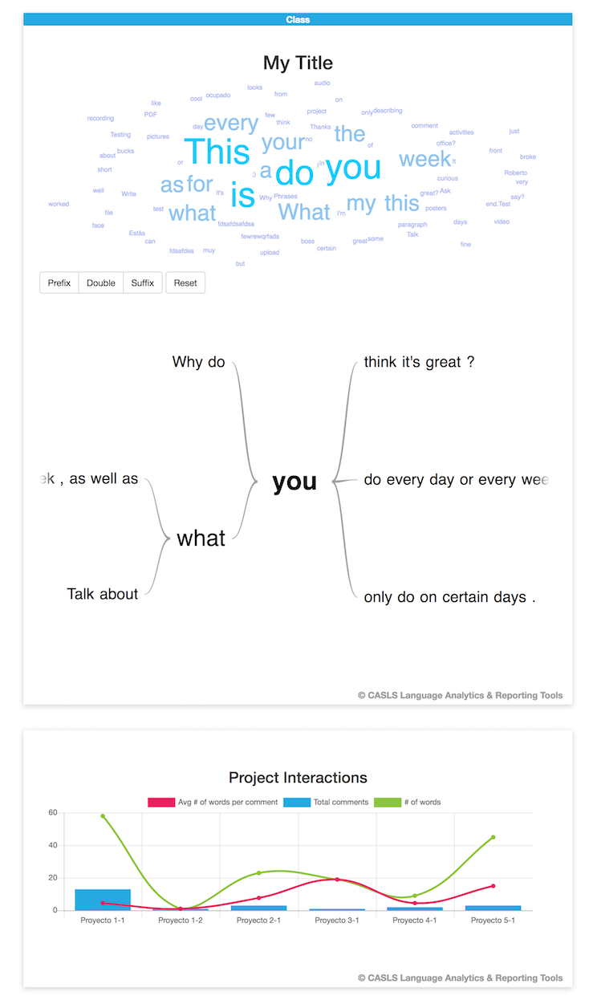

CASLS Language Analytics & Reporting Tools
========================
This project contains a jQuery plugin that will render a collocation widget that includes a word-cloud and word-tree.

## Dependencies
* jQuery [JS Library](https://jquery.com)
* D3 [JS Library](https://github.com/d3/d3)
* jQCloud [jQuery Plugin](https://github.com/mistic100/jQCloud)
* Google Charts (Word Tree) [JS Library](https://developers.google.com/chart/interactive/docs/gallery/wordtree)
* Chart.js [JS Library](https://github.com/chartjs/Chart.js)

## Usage
You must include the javascript dependencies.
```html
<head>
	<!-- jQuery 3.3.1 -->
	<script src="https://code.jquery.com/jquery-3.3.1.min.js" integrity="sha256-FgpCb/KJQlLNfOu91ta32o/NMZxltwRo8QtmkMRdAu8=" crossorigin="anonymous"></script>

	<!-- Twitter Bootstrap 3.3.7 -->
	<script src="https://maxcdn.bootstrapcdn.com/bootstrap/3.3.7/js/bootstrap.min.js" integrity="sha384-Tc5IQib027qvyjSMfHjOMaLkfuWVxZxUPnCJA7l2mCWNIpG9mGCD8wGNIcPD7Txa" crossorigin="anonymous"></script>
	<link rel="stylesheet" href="https://maxcdn.bootstrapcdn.com/bootstrap/3.3.7/css/bootstrap.min.css" integrity="sha384-BVYiiSIFeK1dGmJRAkycuHAHRg32OmUcww7on3RYdg4Va+PmSTsz/K68vbdEjh4u" crossorigin="anonymous">
	
	<!-- D3 -->
	<script src="../d3/d3.min.js" charset="utf-8"></script>
	
	<!-- Google Charts -->
	<script type="text/javascript" src="https://www.gstatic.com/charts/loader.js"></script>
	
	<!-- jQCloud -->
	<script src="../jQCloud/dist/jqcloud.min.js" charset="utf-8"></script>
	<link href="../jQCloud/dist/jqcloud.min.css" rel="stylesheet">
	
	<!-- ChartsJS -->
	<script src="https://cdnjs.cloudflare.com/ajax/libs/Chart.js/2.7.2/Chart.bundle.min.js"></script>
	
	<!-- jQuery CLART Plugin -->
	<script src="../src/jquery-clart.js" charset="utf-8"></script>
</head>
```

Then initialize the Word Cloud - Word Tree chart.
```javascript
$(document).ready(function(){
	var width = $('#collocationWidget').parent().css("width");
	width = width.replace("px", "") - 60;
	
	$("#collocationWidget").collocationWidget({
		wordTree: {
			height:600,
			width: width
		},
		wordCloud: {
			height:300,
			width: width,
			colors: null
		},
		chartTitle: "<label style='position: absolute;top: 0px;left: 0px;background-color: #26A9E0;color: white;width: 100%;padding: 0px;margin-bottom: 0px;text-align:center;'>Class</label><h2 style='text-align:center;'>My Title</h2>",
		allComments: [["Phrases"],["Thanks!"],["Why do you think it's great? I'm curious."],["fdsafdsafdsa"],["fewrewqrfads"],["What no pictures in your office?\u00a0 Ask the boss for a few bucks for posters ;)"],["This is my test comment."],["This project is great."],["Write a short paragraph describing some of your activities this week. Talk about what you do every day or every week, as well as what you only do on certain days.\u00a0"],["Testing file upload from front end.Test PDF\r\n\r\n\u00a0"],["Est\u00e1s muy ocupado, Roberto.\u00a0"],["This is very cool"],["fdsafdsa"],["What can I say?\u00a0 It looks like my face broke the video but this audio recording worked just fine.\u00a0"]],
	});
	
	$("#commentInteractionsWidget").commentInteractionsWidget({
		commentsByProject: {"Proyecto 1-1":["This looks great!","Thanks!","Why do you think it's great? I'm curious.","fdsafdsafdsa","","fsadfdsafdsa","fdsafdsafsda","fdsafdsafsdafdsafdsa","Est\u00e1s muy ocupado, Roberto.\u00a0","This is very cool","fdsafdsa","fdsafdsa","Write a short paragraph describing some of your activities this week. Talk about what you do every day or every week, as well as what you only do on certain days.\u00a0"],"Proyecto 1-2":["fewrewqrfads"],"Proyecto 2-1":["What no pictures in your office?\u00a0 Ask the boss for a few bucks for posters ;)","testing a editted commentfdsafdas","fdsafdsa fdfadsfa fdsafdsa"],"Proyecto 3-1":["What can I say?\u00a0 It looks like my face broke the video but this audio recording worked just fine.\u00a0"],"Proyecto 4-1":["This is my test comment.","This project is great."],"Proyecto 5-1":["Write a short paragraph describing some of your activities this week. Talk about what you do every day or every week, as well as what you only do on certain days.\u00a0","Testing file upload from front end.Test PDF\r\n\r\n\u00a0","Testing file upload from front end.Test PDF\r\n\r\n\u00a0"]}
	});
});
```

## Screenshot



## License
Copyright 2018 Center for Applied Second Language Studies

Licensed under the Apache License, Version 2.0 (the "License");
you may not use this file except in compliance with the License.
You may obtain a copy of the License at

   http://www.apache.org/licenses/LICENSE-2.0

Unless required by applicable law or agreed to in writing, software
distributed under the License is distributed on an "AS IS" BASIS,
WITHOUT WARRANTIES OR CONDITIONS OF ANY KIND, either express or implied.
See the License for the specific language governing permissions and
limitations under the License.